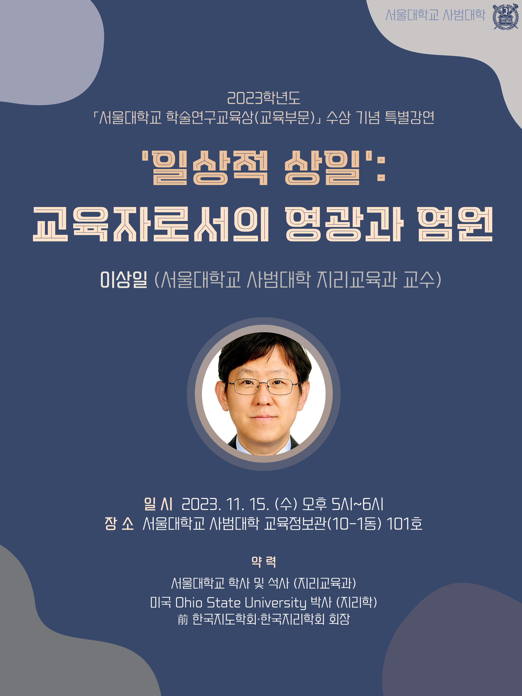

2024년 1월에 이 홈페이지와 블로그를 시작했으니 이 사건은 그 이전의 일이다. 그 때도 올릴까 말까 하다가 소급(?)해서 올리는 것이 자존심이 허락치 않아 그냥 두었었다. 그런데 왜 지금 이 '수상의 추억'을 떠올리려는 것일까? 바탕화면 구석탱이에서 이 이미지를 우연히 발견했고 포스트의 도안이 여전히 예쁘다고 느꼈기 때문만을 아닐 것이다. 그냥 아주 조금 '위로'가 되었다. 이 상을 수상하기 2년 전 즈음일까? 주변의 다른 교수가 어떤 교육상을 받는 것을 지켜보고 있었다. 그 전에는 참으로 무심하게 그런 일들을 받아들였었는데, 그 날은 왠지 조금 슬펐고, 나도 모르게 읖조렸다. "저 분은 어떻게 저 상을 타는 것일까? 나도 참 열심히는 하는데..." 그런데 기적적으로 2년 뒤 그 보다 더 큰 상을 받았다. 내가 한 것보다 남들이 나에게 해준 것이 훨씬 더 크다. 이 상도 마찬가지이다. 남들의 나에 대한 사랑의 우연한, 완벽한 조합이 이 기적을 만들었다. 모든 분들께 감사한다. 내가 왜 사랑을 받았는지의 그 근본을 잊지 않고, 그 길을 뚜벅뚜벅 걸어갈 수 있기를 간절히 기원한다.

강연 내용을 담은 동영상을 올린다. 부끄럽지만, 추억은 늘 아름다운 것이므로...


