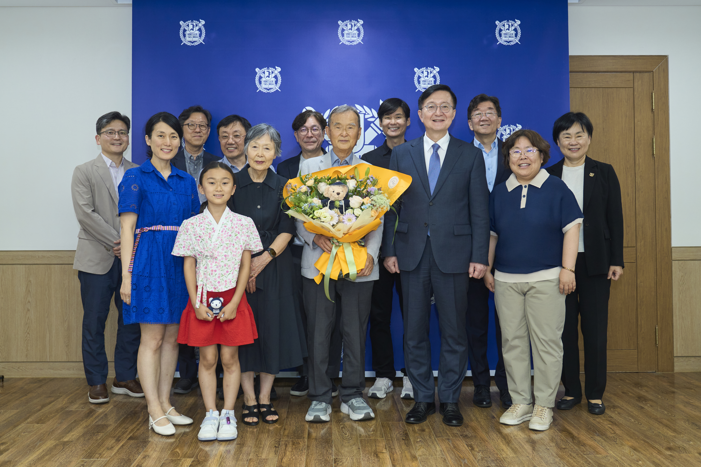

지난 6월에 있었던 일이다. 서울대학교 지리교육과에서 정년을 하신 황만익 교수님께서 모과에 '지리교육과 황만익 장학기금'의 이름으로 50만불(한화 약 7억5천만원)을 기부하셨다. 기부자 감사패 증정식이 6월 16일 총장접견실에서 열렸다.

황만익 교수님 내외분은 현재 미국 캘리포니아에 거주하고 계신데, 올해 3월 미국 샌프란시스코에서 개최된 미국지리학대회에 오셔서 몇몇 한국인 지인들에게 점심을 사주셨다. 그 자리에서 언뜻 기부 의사를 내비치셨는데, 이렇게 큰 금액을 쾌척하실 줄은 상상하지 못했다.

감사패 증정식에서 하신 "서울대학교 지리교육과 덕분에 행복한 삶을 살아왔고, 그 보답을 하는 것일 뿐이다."라는 말씀을 잊을 수 없을 것이다. 그 날 왠지 모를 용기가 나서 이런 말을 했다. "서울대학교 지리교육의 학부생으로, 대학원생으로, 교수로 수십년을 지내왔는데, 서울대 지리교육과가 좋은 의미의 이렇게 큰 스포트라이트를 받은 적은 단 한번도 없었던 것 같습니다. 이런 벅찬 감정을 느끼게 해준 황만익 교수님께 너무나 감사드립니다." 약간 울컥했다. 늙었다.

아는 사람은 알겠지만 차남인 [데니스 황(Dannis Hwang)](https://ko.wikipedia.org/wiki/%ED%99%A9%EC%A0%95%EB%AA%A9)은 [구글의 두들(doodles)](https://doodles.google/)을 탄생시켰고, [\<포켓몬 고\>](https://pokemongo.com/ko)의 총괄 미술 감독을 맡아 게임 설계를 지휘한 매우 유명한 사람이다. 데니스 황은 과천에서 중학교를 다니던 중에 유학길에 올랐고, 스탠퍼드 대학교에서 미술과 컴퓨터공학을 동시에 전공한 매우 드문 이력의 소유자이다. 그 드문 이력이 그 이후에 이룬 것들의 큰 밑거름이 되었을 것이다. 그는 현재 구글에서 분사한 [Niantic Spatial](https://www.nianticspatial.com/) 이라는 회사에 다니고 있다. 사명에서도 느껴지는 것처럼 매우 '지리적'이다. 그 회사는 현재 피지컬 AI와 공간 컴퓨팅을 주로 하는 회사이고, LLM(large language model)에 대한 일종의 더 진보된 대안으로서 LGM(large geospatial model)에 집중하고 있다. AI의 대모 정도로 일컬어지고 있는 스탠포드 대학의 [페이-페이 리(Fei-Fei Li)](https://en.wikipedia.org/wiki/Fei-Fei_Li) 교수가 공간 지능(spatial intelligence)을 핵심에 둔 World Model의 구현을 위해 [World Labs](https://www.worldlabs.ai/)을 창설한 것과 궤를 같이 한다.

감사패 증정식에서 데니스 황은 매우 흥미로운 이야기를 했다. "제가 어렸을 때 아버지와 아버지 제자들이 저희 집이나 아버지 연구실에서 GIS가 어떠니, ESRI가 어떠니, 공간이 어떠니 하는 얘기를 나누는 것을 들은 기억이 선명합니다. 제 삶은 아버지와는 전혀 다른 길로 가는 줄 알았는데, 이제 와 생각하니 'Things come full circle.'이라는 격언을 실감하게 됩니다." [Niantic Spatial](https://www.nianticspatial.com/)을 이끌고 있는 [존 행키(John Hanke)](https://en.wikipedia.org/wiki/John_Hanke)와 [브라이언 맥클렌던(Brian McClendon)](https://en.wikipedia.org/wiki/Brian_McClendon)은 실질적으로 구글 어스와 구글 맵스를 만든 사람들이다. 세상은 참으로 종종 신기하다.